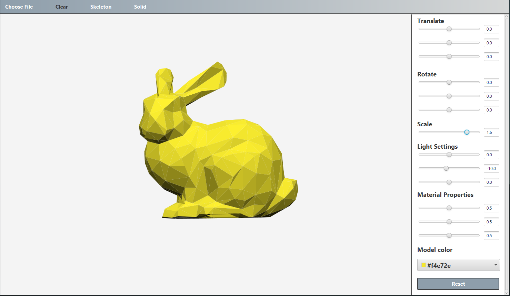
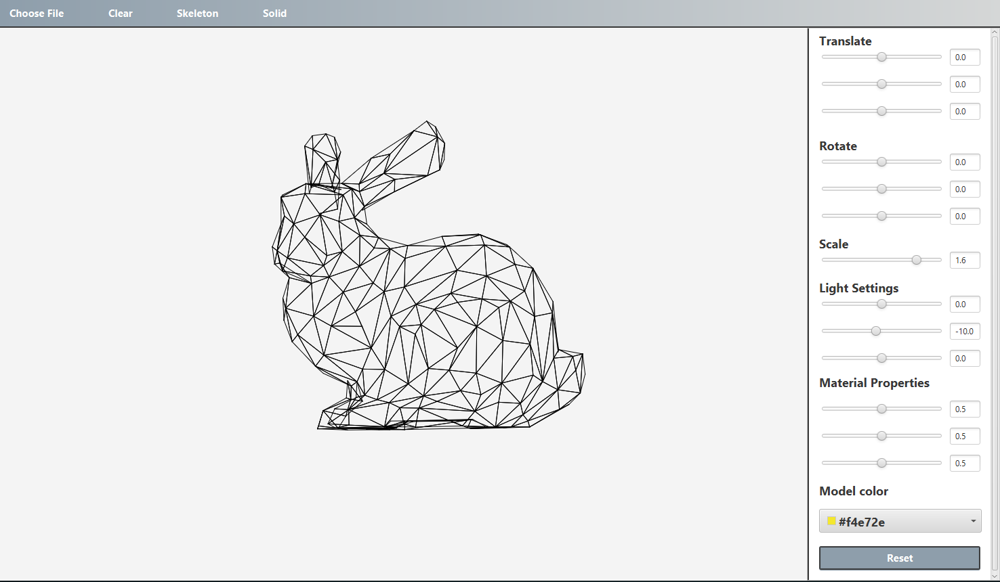
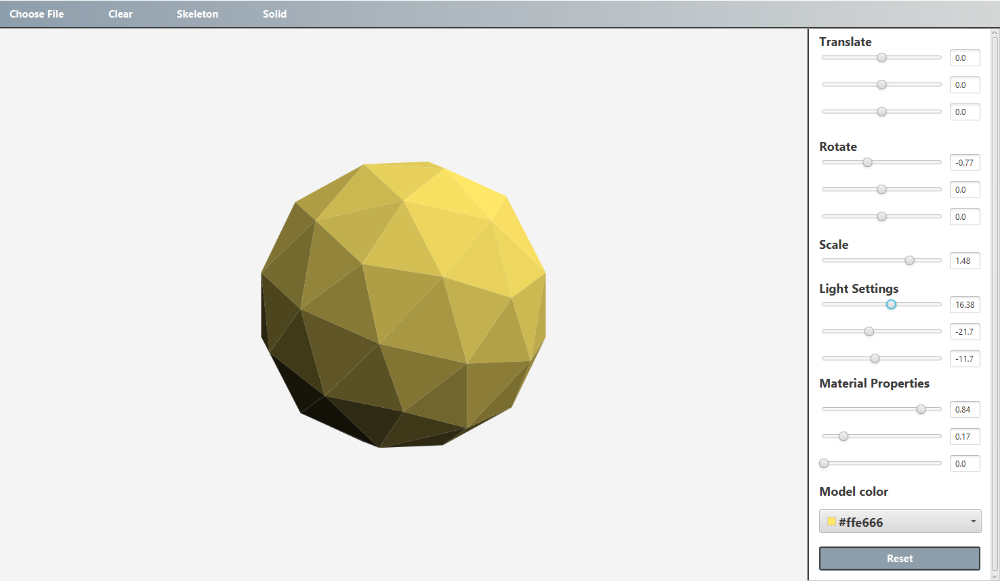

# Mesh Visualizer

Simple mesh visualizer tool built with Java and JavaFx.

Application opens file of .obj type.

Object can be displayed as skeleton or as solid object.  

Application uses Blinn-Phong reflection model for shading.

